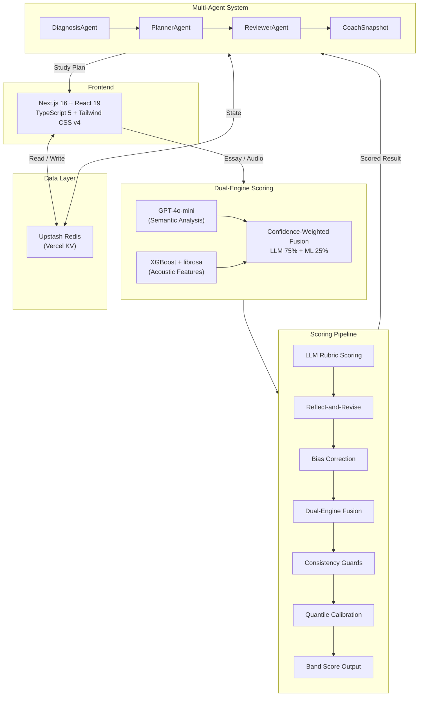

<div align="center">

# IELTS AI Platform

**AI-powered IELTS preparation with dual-engine scoring, multi-agent study planning, and spaced repetition.**

[](https://nextjs.org/)
[](https://www.typescriptlang.org/)
[](https://openai.com/)
[](https://tailwindcss.com/)
[](https://vercel.com/)
[]()

<br />

[**Live Demo**](https://ielts-ai-platform-web.vercel.app) &nbsp;&middot;&nbsp; [Architecture](#architecture) &nbsp;&middot;&nbsp; [Key Results](#key-results) &nbsp;&middot;&nbsp; [Features](#feature-highlights) &nbsp;&middot;&nbsp; [Tech Stack](#tech-stack) &nbsp;&middot;&nbsp; [Contact](#contact)

</div>

---

## Screenshots

| Dashboard | Writing Scoring Results |
|:---------:|:----------------------:|
|  |  |

| Speaking Recording | Score Trend Chart |
|:------------------:|:-----------------:|
|  |  |

| Error Notebook & Spaced Repetition |
|:-----------------------------------:|
|  |

---

## Architecture



---

## Key Results

Evaluation on a 50-essay internal benchmark, scored against certified IELTS examiners:

| Metric | Value | Notes |
|--------|-------|-------|
| **MAE** | **0.570 bands** | Mean Absolute Error across all criteria |
| **Accuracy within +/-0.5 band** | **74%** | Predictions within half a band of examiner score |
| **Accuracy within +/-1.0 band** | **90%** | Predictions within one full band |
| **Systematic Bias** | **-0.03** | Near-zero; no consistent over/under-scoring |

**Benchmark context:** Commercial Automated Essay Scoring (AES) systems target QWK >= 0.75. Human inter-rater agreement ceiling is approximately 0.77 QWK. Our pipeline achieves competitive accuracy through multi-stage calibration and dual-engine fusion.

---

## Feature Highlights

### Dual-Engine Scoring
Combines GPT-4o-mini semantic analysis (75% weight) with XGBoost/librosa acoustic feature extraction (25% weight) through confidence-weighted fusion. A six-stage calibration pipeline (LLM scoring, Reflect-and-Revise, bias correction, fusion, consistency guards, quantile calibration) ensures reliable band score output.

### FSRS v4.5 Spaced Repetition
Error notebook powered by the Free Spaced Repetition Scheduler (FSRS v4.5), upgraded from SM-2 for superior retention modeling. Mistakes from writing and speaking practice are automatically captured and scheduled for review at optimal intervals.

### Real-Time Voice Waveform
Live audio visualization during speaking practice with waveform rendering. Provides immediate visual feedback on speech pacing, volume, and silence patterns.

### Gamification System
- **XP and Levels** -- Earn experience points for every practice session
- **Streaks** -- Daily practice tracking with streak protection
- **Daily Challenges** -- Targeted micro-tasks to build consistency
- **Personal Records** -- Track best scores across all skill areas
- **Leaderboard** -- Community ranking and friendly competition

### Multi-Agent Study Planning
An orchestrated agent pipeline analyzes learner performance:
- **DiagnosisAgent** -- Identifies weak areas and patterns from scoring history
- **PlannerAgent** -- Generates personalized weekly study plans
- **ReviewerAgent** -- Validates plan quality and adjusts difficulty
- **CoachSnapshot** -- Delivers a concise progress summary with actionable next steps
- Built-in anomaly detection flags unusual score fluctuations

### SEO, PWA, and Dark Mode
Server-rendered pages with sitemap generation and robots.txt for search engine visibility. Progressive Web App support for mobile installation. System-aware dark mode with manual toggle.

---

## Tech Stack

| Layer | Technology |
|-------|-----------|
| **Framework** | Next.js 16 (App Router) + React 19 |
| **Language** | TypeScript 5 |
| **Styling** | Tailwind CSS v4 |
| **Auth** | NextAuth.js v5 (Auth.js) |
| **LLM** | OpenAI GPT-4o-mini |
| **ML Pipeline** | Python + XGBoost + librosa |
| **Persistence** | Upstash Redis (Vercel KV) |
| **Spaced Repetition** | FSRS v4.5 |
| **Validation** | Zod v4 |
| **Deployment** | Vercel |
| **Monorepo** | Yarn Workspaces |

---

## Project Structure

```
ielts-ai-platform/
├── apps/
│   └── web/                 # Next.js 16 frontend
│       ├── app/             # App Router pages (dashboard, writing, speaking, ...)
│       ├── components/      # Shared UI components
│       ├── features/        # Feature modules (gamification, auth, community, ...)
│       ├── lib/
│       │   ├── agents/      # Multi-agent orchestration
│       │   ├── scoring/     # Dual-engine scoring pipeline
│       │   └── ...          # KV, OpenAI, spaced repetition, etc.
│       └── tests/           # Unit and integration tests
├── ml/                      # Python ML service (XGBoost, librosa, ASR)
├── docs/                    # Architecture and design documents
└── screenshots/             # Product screenshots
```

---

## Contact

| | |
|---|---|
| **GitHub** | [@foxdog1011](https://github.com/foxdog1011) |
| **LinkedIn** | [linkedin.com/in/foxdog1011](https://linkedin.com/in/foxdog1011) |
| **Live Demo** | [ielts-ai-platform-web.vercel.app](https://ielts-ai-platform-web.vercel.app) |

---

<div align="center">

Built with Next.js, TypeScript, and GPT-4o-mini.

**Source code is private.** This repository serves as a product showcase.

</div>
