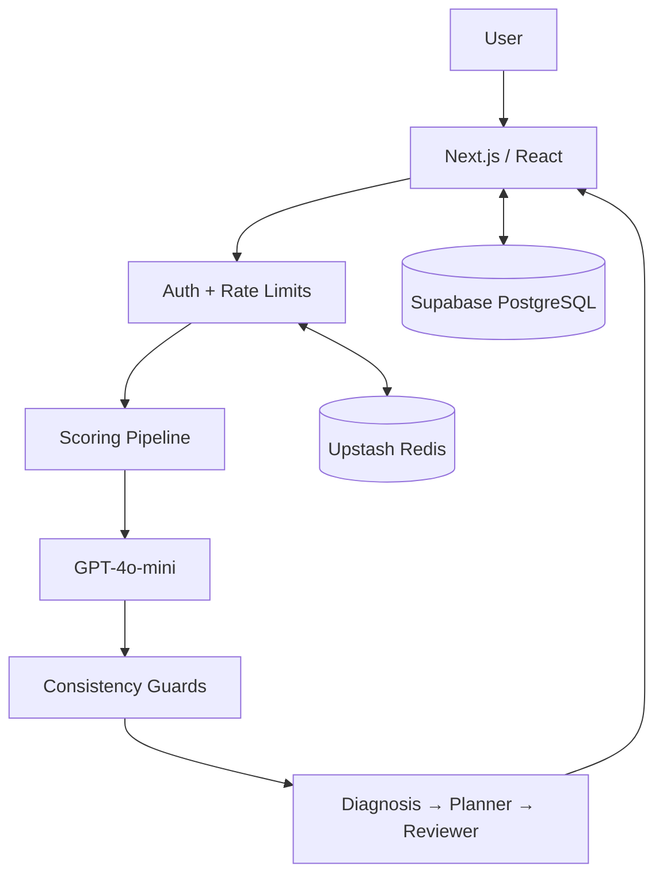

<div align="center">

# IELTS AI Platform

**A production AI learning platform with measurable scoring, evaluation infrastructure, and personalized learning workflows.**

[](https://nextjs.org/)
[](https://www.typescriptlang.org/)
[](https://openai.com/)
[](https://supabase.com/)
[](https://vercel.com/)

[**Live Product**](https://lumi.integratewise.com) · [Architecture](#architecture) · [Engineering Case Studies](#engineering-case-studies) · [Evaluation](#evaluation) · [Tech Stack](#tech-stack)

</div>

---

## Overview

IELTS AI Platform turns writing and speaking practice into a measurable feedback loop: **submission → scoring → diagnosis → learning plan → progress tracking**.

The project is built as a production AI system rather than a single-model wrapper. Scoring behavior is evaluated against official examiner-scored samples, model changes are tested against a measured noise floor, and technically plausible ideas are rejected when controlled experiments do not support them.

The production source repository is private. This repository presents the system architecture, product surface, evaluation methodology, and engineering lessons.

---

## Screenshots

| Dashboard | Writing Scoring Results |
|:---------:|:----------------------:|
|  |  |

| Speaking Recording | Score Trend |
|:------------------:|:-----------:|
|  |  |

| Error Notebook & Spaced Repetition |
|:-----------------------------------:|
|  |

---

## Architecture



### Scoring Flow

```text
Essay / transcript
    ↓
Rubric scoring
    ↓
Reflect-and-revise review
    ↓
Consistency guards
    ↓
Band calculation
    ↓
Diagnosis
    ↓
Personalized study plan
```

The current production scorer runs entirely on Vercel with GPT-4o-mini; an earlier local ML path is retained only as legacy code and is not part of the active production scoring architecture.

---

## Engineering Highlights

### AI Evaluation as Infrastructure

Evaluation is treated as part of the product architecture, not as a one-off experiment. The project maintains an official examiner-scored gold set, repeatable evaluation scripts, regression tests, and explicit thresholds for deciding whether a metric change is meaningful.

### Multi-Agent Learning Workflow

After scoring, a structured agent pipeline turns raw evaluation output into learner-facing actions:

- **DiagnosisAgent** identifies weaknesses and anomalies.
- **PlannerAgent** converts evidence into a study plan.
- **ReviewerAgent** applies deterministic consistency checks before results reach the user.

### Production Product System

The application includes authentication, persistent learner state, progress tracking, spaced repetition, gamification, and deployment automation around the scoring core. It is designed as an end-to-end user product rather than an isolated model demo.

### Testability

Core scoring and orchestration logic is separated from UI concerns and covered by automated tests. Evaluation harnesses are also tested to prevent subtle input mismatches from producing misleading benchmark results.

---

## Engineering Case Studies

### 1. Replacing a Misleading Benchmark

**Problem**  
An earlier evaluation set looked useful numerically but did not provide trustworthy ground truth for product decisions.

**Diagnosis**  
The labels were not equivalent to official examiner-scored IELTS samples, so high or low agreement could reflect label quality rather than scorer quality.

**Fix**  
The evaluation workflow was rebuilt around 26 official IELTS.org samples with official task prompts, bands, and examiner commentary. Three samples used as prompt anchors are excluded from scoring evaluation, leaving 23 independent scored samples.

**Result**  
The project now distinguishes between trustworthy evaluation data and noisy regression-only datasets instead of reporting a single attractive metric from whichever dataset performs best.

---

### 2. Measuring the Noise Floor Before Claiming Improvement

**Problem**  
LLM-based scoring varies between repeated runs, so a small metric increase can look like an engineering improvement even when the code has not changed.

**Experiment**  
Three identical evaluation runs were measured on the same 23-sample official set.

| Metric | Observed run-to-run spread |
|---|---:|
| Spearman | ±0.011 |
| MAE | ±0.044 |

**Decision rule**  
Changes smaller than roughly **0.02 Spearman** or **0.05 MAE** are treated as noise rather than evidence of improvement.

This changed how experiments are interpreted: a new approach must clear the measured variance of the pipeline before it is considered better.

---

### 3. Rejecting a Plausible Scoring Improvement

**Hypothesis**  
The scoring system had several one-directional penalty rules. Adding corresponding positive-credit rules seemed like a reasonable way to reduce high-band under-scoring.

**Test**  
The modified scorer was run repeatedly against the same evaluation set and compared with the control.

**Result**  
The credit-rule version produced lower rank correlation than the control by more than the measured noise floor.

**Decision**  
The change was reverted rather than retained because it sounded conceptually correct. The result pointed toward a different class of solution: better decidable evidence, a different arbitration step, or a stronger model.

---

### 4. Model Upgrade Assumptions Failed in Production-Like Evaluation

A newer model was initially treated as a drop-in replacement. Evaluation exposed several hidden assumptions instead:

- model capabilities had been inferred from model-name patterns;
- token-parameter logic existed in two places and had drifted;
- reasoning tokens consumed the output budget differently on long prompts;
- one scoring component still pinned the previous model, invalidating a clean A/B comparison.

The experiment was stopped rather than reported as a model-quality comparison because the configuration itself was not yet controlled.

---

## Evaluation

### Official Gold Set

The current trusted writing benchmark uses official IELTS.org samples.

| Slice | MAE | Within ±0.5 | Within ±1.0 | Spearman |
|---|---:|---:|---:|---:|
| Official samples, all | 0.826 | 43.5% | 82.6% | **0.778** |
| General Training + Task 2 | 0.765 | 58.8% | 82.4% | **0.826** |

These numbers are intentionally presented with dataset context rather than as a universal claim of scorer accuracy. The benchmark is small, and different IELTS task types show materially different error behavior.

### Why Rank Correlation Matters Here

Absolute error shows how far predictions are from examiner bands, while Spearman correlation measures whether stronger and weaker responses are ordered consistently. The project tracks both because a scorer can appear well-calibrated on average while still ranking responses poorly.

---

## Product Features

The engineering work supports a complete learner experience:

- Writing and speaking practice flows
- Personalized diagnosis and study planning
- Error notebook and spaced repetition
- Progress history and learning analytics
- Timed exam simulation
- Gamification and practice goals
- Authentication and persistent profiles

---

## Technical Decisions

### Why keep deterministic guards around an LLM scorer?

LLM outputs are flexible but can violate known product constraints. Deterministic checks catch conditions that are cheap and unambiguous to validate, while leaving semantic judgment to the model.

### Why maintain a gold set separately from product data?

User submissions are useful for product analytics but usually lack reliable examiner labels. A separate benchmark prevents product usage data from being mistaken for evaluation ground truth.

### Why measure variance before tuning prompts?

Without a noise estimate, prompt iterations encourage overfitting to random run-to-run movement. The measured noise floor creates a minimum bar that an experimental change must exceed.

### Why reject improvements instead of continuously stacking rules?

Additional rules increase system complexity and can interact in unexpected ways. A change that does not produce measurable improvement is removed rather than becoming permanent prompt debt.

---

## Tech Stack

| Layer | Technology |
|---|---|
| **Frontend** | Next.js 16, React 19, TypeScript 5 |
| **AI** | OpenAI GPT-4o-mini |
| **Data** | Supabase PostgreSQL, Upstash Redis |
| **Auth** | NextAuth v5 |
| **Validation** | Zod |
| **Testing** | Node.js built-in test runner, custom evaluation harnesses |
| **Deployment** | Vercel |
| **Styling** | Tailwind CSS v4 |

---

## Repository Note

This is a public technical showcase. The production source code, credentials, internal datasets, and sensitive operational configuration remain in a private repository.
