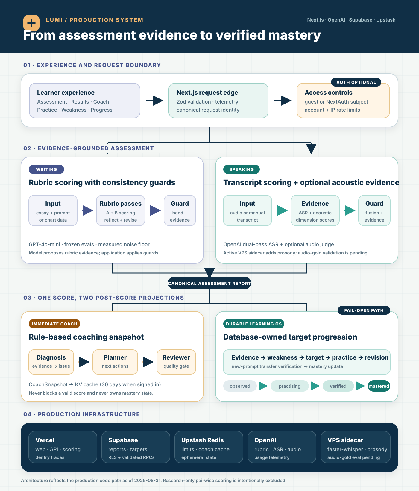

<div align="center">

# Lumi — IELTS AI Learning System

**AI assessment, evidence-grounded coaching, and a verified learning loop.**

[](https://nextjs.org/)
[](https://www.typescriptlang.org/)
[](https://platform.openai.com/)
[](https://supabase.com/)
[](https://vercel.com/)

[Live product](https://lumi.integratewise.com) · [Architecture](#production-architecture) · [Evaluation](#evaluation-results) · [Engineering case studies](#engineering-case-studies)

</div>

---

## What Lumi Does

Lumi is a longitudinal IELTS learning system, not a one-shot band-score generator. An eligible Writing or Speaking assessment becomes durable evidence: the system identifies a weakness, creates a target, guides revision or practice, verifies transfer on a new prompt, and updates mastery only after repeated evidence.

```text
assessment -> evidence -> weakness -> target -> practice -> revision
           -> transfer verification -> mastery update
```

The production application is source-private because it contains authentication, billing, scoring, and data-ownership logic. This repository is the public engineering case study: it documents the shipped architecture, measured evaluation results, and selected design decisions without publishing the proprietary implementation.

## Production Architecture

<a href="./assets/lumi-production-architecture.svg">
  
</a>

[Open the full-size SVG](./assets/lumi-production-architecture.svg) · [Download the PNG export](./assets/lumi-production-architecture.png)

The diagram makes four important ownership boundaries explicit:

- **Authentication is optional at the scoring boundary.** Guest and signed-in attempts both pass request identity, validation, and account/IP rate limits; signed-in learners additionally receive durable history and targets.
- **Writing and Speaking are different pipelines.** Writing uses two rubric passes plus reflection/revision and consistency guards. Speaking adds ASR, acoustic evidence, dimension scoring, fusion, and speaking-specific guards.
- **Immediate coaching is deterministic today.** The Diagnosis → Planner → Reviewer sequence is rule-based and produces a cached `CoachSnapshot`; it does not mutate mastery state.
- **The database owns durable learning state.** After a canonical assessment is stored, a fail-open projection sends evidence to a validated Supabase RPC. Model output can propose evidence, but it cannot directly promote a target.

Target progression is deterministic:

```text
observed -> practising -> verified -> mastered
```

A passing revision can move a target to `verified`. Transfer must then be demonstrated on a new prompt. Two qualifying transfer passes are required for `mastered`; a failed transfer resets the streak.

> Reading and Listening are currently baseline-only. They do not create learning targets until the production content pools and transfer-verification path are complete.

## Current Learner Surface

- Writing Task 1 and Task 2 assessment with rubric-level evidence and feedback
- Speaking Part 1–3 assessment from recorded audio or a supplied transcript
- Results, history, Coach Today, Weakness, Progress, and guided micro-practice
- Persistent learning targets for eligible Writing and Speaking assessments
- Streak, weekly-goal, and personal-record tracking
- XP only for verified progress events such as completing a linked drill or verifying a target — never for score submission alone
- Speaking mock-exam fallback for the exam stage; no unfinished mock surface is advertised as a core loop

## Evaluation Results

### Writing Official-Gold Baseline

The frozen official IELTS Writing set contains 26 samples. Three anchor prompts are excluded from aggregate reporting, leaving 23 evaluation samples.

| Cohort | n | MAE | Within 0.5 band | Within 1.0 band | Spearman ρ |
|---|---:|---:|---:|---:|---:|
| All eligible samples | 23 | 0.826 | 43.5% | 82.6% | 0.778 |
| General Training + Task 2 | 17 | 0.765 | 58.8% | 82.4% | 0.826 |

Repeated no-change runs measured an approximate noise floor of **±0.011 Spearman** and **±0.044 MAE**. Changes smaller than roughly 0.02 Spearman or 0.05 MAE are treated as noise rather than improvement.

These numbers describe the internal frozen evaluation set. Lumi does not claim equivalence to an official IELTS examiner or the live exam.

Speaking accuracy is intentionally not reported. The legacy Speaking anchors are synthetic and transcript-only, so they cannot validate pronunciation, fluency acoustics, or agreement with an examiner. The next defensible benchmark requires real candidate audio with examiner-assigned scores.

## Engineering Case Studies

### 1. A Frozen Benchmark Prevented Metric Drift

Earlier experiments mixed prompt types and moving sample sets, making results hard to compare. The current harness freezes official samples, excludes anchors consistently, and reports both absolute error and rank correlation. This turned “the scorer feels better” into a reproducible claim.

### 2. Stability Mattered Before Tuning

LLM scoring is stochastic. The team first measured repeated-run variance, then introduced structured rubric passes, reflection/revision, and consistency guards. Experiments are accepted only when the improvement clears the measured noise floor.

### 3. Plausible Positive-Credit Rules Were Rejected

The rubric contained several one-directional penalty rules, so adding corresponding positive-credit rules appeared likely to reduce high-band under-scoring. Repeated controlled runs instead reduced rank correlation beyond the measured noise floor. The change was reverted rather than retained as permanent prompt debt.

### 4. A Model Migration Exposed Configuration Drift

A GPT-5.2 experiment exposed assumptions that prevented a clean comparison: capabilities had been inferred from model names, token-parameter logic had drifted between call sites, reasoning tokens changed the output budget, and one scoring component still pinned the previous model. The experiment was stopped instead of being reported as a model-quality result. The production rubric scorer remains on GPT-4o-mini.

### 5. Pairwise Ranking Is Research, Not Production

Recent prototypes test whether comparative judgments are more stable than direct band prediction. Held-out Writing and transcript-only Speaking experiments show promising ordinal ranking, but the samples are small and the methods are not wired into the production request path. The repository labels those results as research instead of presenting them as shipped capability.

## Reliability & Operating Constraints

- Scoring stays authoritative: coaching or learning-state projection failure must not discard a valid score.
- Idempotency and legal state transitions are enforced in PostgreSQL RPCs.
- Rate limits use account and IP identity with server-side accounting.
- Server-only Supabase credentials are guarded from browser imports.
- Cost, latency, and trace metadata are recorded for scoring operations.
- Vercel owns the scoring orchestration. Recorded Speaking attempts can also call an active, authenticated VPS acoustic sidecar; its signal priority is operational but not yet validated against an examiner-scored audio set.

## Stack

| Layer | Production choice |
|---|---|
| Web and API | Next.js 16, React 19, TypeScript 5 |
| Validation | Zod |
| AI scoring | OpenAI GPT-4o-mini |
| Speech evidence | GPT-4o-mini-transcribe, a Whisper acoustic pass, optional OpenAI audio judge, and an authenticated VPS acoustic sidecar |
| Durable data | Supabase PostgreSQL with Row Level Security |
| Ephemeral state | Upstash Redis / Vercel KV |
| Authentication | NextAuth with subject binding |
| Observability | Sentry, structured logs, cost and latency telemetry |
| Deployment | Vercel |

## Repository Note

This showcase intentionally contains documentation and visual assets only. It does not include production source, secrets, user data, internal prompts, or deploy credentials.

---

<div align="center">

Built and evaluated as a production learning system — with explicit limits, reproducible metrics, and state transitions the model does not own.

</div>
